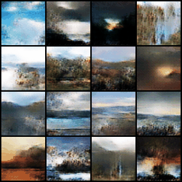
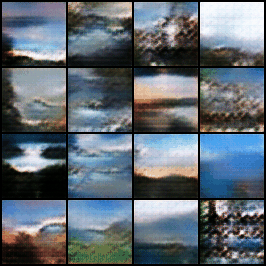
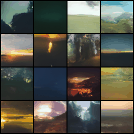

# Landscape Image Generation Using GANs and Diffusion Models

This repository contains implementations of multiple approaches for generating high-quality landscape images using various Generative Adversarial Networks (GANs) and a Diffusion Model.

---

## Branches
- **`main`**: Implementation of a Diffusion Model.
- **`DCGAN`**: Implementation of a Deep Convolutional GAN (DCGAN).
- **`WGAN`**: Implementation of a Wasserstein GAN with Gradient Penalty and Feature Matching Loss.

All models are trained on the **Landscapes HQ (LHQ) 1024×1024** dataset, which contains **90,000 images** of diverse landscapes.

---

## Table of Contents
- [Project Structure](#project-structure)
- [Dataset](#dataset)
- [Training](#training)
- [How to Use](#how-to-use)
- [Samples](#samples)
- [Acknowledgments](#acknowledgments)

---

## Project Structure

```plaintext
.
├── data/           # folder containing the dataset
├── dataloader.py   # module containing the dataset and dataloader
├── model.py        # module containing the model architecture
├── pl_module.py    # module containing the train-logic (trainer)
└── train.ipynb     # jupyter notebook containing the settings and hyperparameters for training
```

---

# Dataset
The Landscapes HQ (LHQ) dataset, originally created by Ivan Skorokhodov, Grigorii Sotnikov and Mohamed Elhoseiny, is used to train models.
It consists of 90.000 high-resolution landscape images at a resolution of 1024x1024 pixels.

- **Features:** The dataset includes a wide range of landscapes, such as mountains, forests, beaches and more.
- **Augumentation:** Images are resized and cropped to a resolution of 64x64 pixels.
- **Source:** The dataset is available [here](https://github.com/universome/alis)

To use the dataset: 
1. Download it and place the images in the **`./data/`** directory.
2. The folder structure should be as followed:

([Kaggle](https://www.kaggle.com/datasets/dimensi0n/lhq-1024))
```plaintext
./data/
└── train/
    └── dataset/
        ├── 00000.jpg
        ├── 00001.jpg
        └── ...
```

---

# Training
Each branch includes a dedicated **`train.ipynb`** notebook for training the respective model.


### Hyperparameters

#### General parameters
| Parameter      | Description                              | Default       |
|----------------|------------------------------------------|---------------|
| `n_workers`    | Number of Threads for loading the data   | 4             |       
| `num_valid`    | Number of images for validation          | 16            |

#### Diffusion Model
| Parameter      | Description                              | Default       |
|----------------|------------------------------------------|---------------|
| `epochs`       | Number of training epochs                | 100           |
| `batch_size`   | Batch size for training                  | 64            |
| `lr`           | Learning rate                            | 0.0001        |
| `betas`        | Adam optimizer betas                     | (0.95, 0.999) |
| `nc`           | Number of in- and out-channels           | 3             |
| `image_size`   | Size of images in pixels                 | (64, 64)      |
| `beta_schedule`| Function to schedule betas of forward step | linear      |
| `num_train_timesteps` | Number of forward diffusion steps while training  | 1000          |
| `num_inference_timesteps` | Number of denoising steps to generate the images  | 1000          |

#### DCGAN specific
| Parameter      | Description                              | Default       |
|----------------|------------------------------------------|---------------|
| `epochs`       | Number of training epochs                | 100           |
| `batch_size`   | Batch size for training                  | 16            |
| `lr`           | learning rate                            | 0.0002        |
| `betas`        | Adam optimizer betas                     | (0.5, 0.999)  |
| `nz`           | length of the random noise input vector  | 100           |
| `ngf`          | feature map size for the generator       | 64            |
| `ndf`          | feature map size for the discriminator/critic | 64       |

#### WGAN specific (DCGAN + ...)
| Parameter      | Description                              | Default       |
|----------------|------------------------------------------|---------------|
| `lambda_gp`    | Factor to weigh gradient penalty         | 10            |

---

# How To Use
## Geting Started

This guide explains the basics of getting this application to run.

1. **Clone this Repository**
You need to clone this repository to your local workspace.

2. **Create a virtual Environment**
To run this application you first need to create a virtual environment within the project folder.
```bash
python -m venv .venv
```
Activate the virtual environment:
```bash
./.venv/Scripts/activate    # (Windows)
./.venv/bin/activate        # (Linux/Mac)
```
3. **Install Dependencies**
Install all required Python packages listed in the **`requirements.txt`** file.
```bash
pip install -r requirements.txt
```

4. **Select different Models**
You simply can switch branches to select different Models:
```bash
git checkout branch_name
```
*branch_name* can be:
    - main : Diffusion Model
    - WGAN : Wasserstein GAN with gradient penalty
    - DCGAN : Deep Convolutional GAN

## Train the Models

This guide explains how to train the models.

1. Download the Dataset
Before you start training, you need to download the dataset as described in the [Dataset](#dataset) Section.

2. Start Training
Open the **`train.ipynb`** notebook and select your activated virtual environment as the kernel.

You may want to change some hyperparameters in the notebook. These are explained in more detail in the README.

3. MLflow Support
Training supports MLflow for tracking experiments. You can use the MLflow Web UI by running:

```bash
mlflow ui
```

That's it! You can relax while training the model!

## Generate Images

TODO!

## Image Generation with a Pretrained GAN Model

This guide explains how to generate images using a pretrained model available under the *Releases* section of this repository.

1. **Download the Pretrained Model**  
   - Navigate to the *Releases* section of this repository.  
   - Download the **`model.weights.pth`** file. (Note: the artifacts differ between the branches)

2. **Setup the Weights**  
   - Place the downloaded file in the `./data/weights/` directory.  
   - Open the `generate_images_pretrained.ipynb` notebook.  
   - Update the `weights_path` parameter in the notebook to match the location of the pretrained model.  

3. **Select the Virtual Environment**
   - Ensure the appropriate virtual environment is activated.  
   - Select it as the kernel for the Jupyter Notebook.

4. **Run the Notebook**
   - Make sure that you are in the correct branch (the pretrained modles require their specific pl_module to work).
   - Execute the notebook step by step.

---

# Samples

These gifs visualize the artifacts of every tenth epoch training the different models.

<div style="display: flex; justify-content: space-around; align-items: center;">

  <div style="text-align: center;">
    
    <p>DCGAN</p>
  </div>

  <div style="text-align: center;">
    
    <p>WGAN</p>
  </div>

  <div style="text-align: center;">
    
    <p>Diffusion model</p>
  </div>

</div>

---
